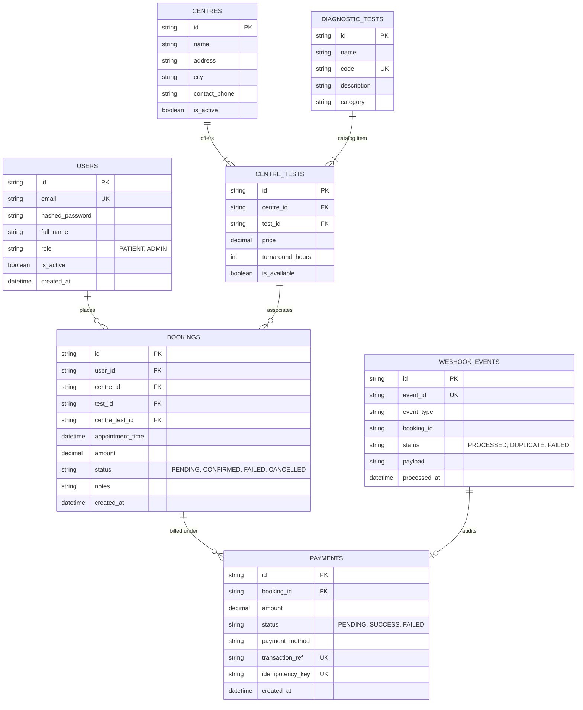

# EVE Healthcare — Diagnostic Booking & Simulated Payment Backend Service

[](https://www.python.org/)
[](https://fastapi.tiangolo.com)
[](https://www.sqlalchemy.org/)
[](https://www.postgresql.org/)
[](https://www.docker.com/)
[]()

Production-ready backend service for diagnostic test bookings and simulated payments, built for the **EVE Healthcare SDE Intern Backend Engineering Assignment**.

---

## Table of Contents

1. [Architecture & Design Overview](#architecture--design-overview)
2. [Tech Stack & Justifications](#tech-stack--justifications)
3. [Database & Schema Design](#database--schema-design)
4. [How to Run Locally](#how-to-run-locally)
   - [Option A: Docker Compose (PostgreSQL + Redis + FastAPI)](#option-a-docker-compose-recommended-for-evaluation)
   - [Option B: Local Virtualenv (Zero-friction SQLite or Local Postgres)](#option-b-local-virtualenv)
5. [API Endpoints & cURL Examples](#api-endpoints--curl-examples)
   - [1. Authentication](#1-authentication)
   - [2. Diagnostic Centres & Tests](#2-diagnostic-centres--tests)
   - [3. Booking System](#3-booking-system)
   - [4. Simulated Payment Service](#4-simulated-payment-service)
   - [5. Payment Webhook (Strict Idempotency)](#5-payment-webhook-strictly-idempotent)
6. [Interactive Web UI Dashboard](#interactive-web-ui-dashboard)
7. [Interactive Swagger / OpenAPI Documentation](#interactive-swagger--openapi-documentation)
8. [Edge Cases Handled](#edge-cases-handled)
9. [Bonus Engineering Features Implemented](#bonus-engineering-features-implemented)
10. [Important Assumptions Made](#important-assumptions-made)
11. [Future Improvements](#what-we-would-improve-with-more-time)

---

## Architecture & Design Overview

The project adheres to **Clean Layered Architecture**, enforcing separation of concerns across presentation, business logic, data persistence, and domain models:

```
eve_healthcare/
├── app/
│   ├── api/                     # HTTP Presentation Layer
│   │   ├── deps.py              # Auth & RBAC Dependency Injection
│   │   └── v1/
│   │       ├── api.py           # V1 Router Aggregator
│   │       └── endpoints/       # Route Handlers (auth, centres, tests, bookings, payments)
│   ├── core/                    # Infrastructure & Cross-Cutting Concerns
│   │   ├── config.py            # Pydantic Settings & Environment
│   │   ├── database.py          # SQLAlchemy 2.0 Engine & Session
│   │   ├── security.py          # Bcrypt hashing & PyJWT token management
│   │   ├── cache.py             # Redis client with in-memory fallback
│   │   ├── rate_limiter.py      # Sliding-window rate limiter
│   │   ├── logging.py           # Structured logging & X-Request-ID middleware
│   │   └── exceptions.py        # Centralized domain exceptions & error codes
│   ├── models/                  # SQLAlchemy Relational Models (declarative)
│   ├── schemas/                 # Pydantic v2 Request/Response Validation DTOs
│   └── services/                # Business Logic Services & State Transitions
├── tests/                       # Unit & Integration Pytest Suite
├── Dockerfile                   # Multi-stage container build
├── docker-compose.yml           # Multi-container orchestration (App, Postgres, Redis)
├── requirements.txt             # Locked production dependencies
├── seed_data.py                 # Initial data seeder (centres, tests, users)
└── README.md                    # Project documentation
```

---

## Tech Stack & Justifications

| Component | Selected Tech | Reason / Justification |
| :--- | :--- | :--- |
| **Language & Framework** | **Python 3.13 + FastAPI** | High performance, native async support, strict type annotations, and out-of-the-box interactive OpenAPI/Swagger docs (`/docs`). |
| **Database & ORM** | **PostgreSQL + SQLAlchemy 2.0** | PostgreSQL provides robust ACID transactions, row locking, and unique constraints. Supports effortless zero-setup SQLite for rapid testing. |
| **Data Validation** | **Pydantic v2** | Strict validation, sanitization of inputs, and descriptive 422 error schemas. |
| **Authentication** | **PyJWT + Bcrypt** | Stateless JWT Bearer tokens with encrypted salted password hashing. |
| **Caching Layer** | **Redis + In-Memory Fallback** | Sub-millisecond catalog reads with automatic cache invalidation on writes. Seamlessly falls back to memory cache if Redis is offline. |
| **Containerization** | **Docker & Docker Compose** | Reproducible multi-service deployment orchestrating API, PostgreSQL 16, and Redis 7. |
| **Testing** | **Pytest + Pytest-Cov + HTTPX** | Unit, integration, and idempotency tests with comprehensive code coverage. |

---

## Database & Schema Design

### Entity Relationship Diagram



---

## How to Run Locally

### Option A: Docker Compose (Recommended for Evaluation)

Runs the FastAPI service, PostgreSQL 16, and Redis 7 in isolated containers:

```bash
# 1. Clone repository
git clone <repo_url>
cd eve_healthcare

# 2. Start services
docker compose up --build

# The service is immediately live at http://localhost:8000
# Interactive Swagger UI: http://localhost:8000/docs
```

---

### Option B: Local Virtualenv

You can run the application with **SQLite** (zero database setup needed) or connect it to your local **PostgreSQL** instance:

```bash
# 1. Create and activate virtual environment
python -m venv venv

# Windows:
.\venv\Scripts\activate
# Linux/macOS:
source venv/bin/activate

# 2. Install dependencies
pip install -r requirements.txt

# 3. Seed initial database data (admin, patients, centres, tests)
python seed_data.py

# 4. Start the development server
uvicorn app.main:app --reload --port 8000
```

To run tests and view test coverage:

```bash
pytest -v
pytest --cov=app --cov-report=term-missing
```

---

## API Endpoints & cURL Examples

Default seeded users available for testing:
- **Admin**: `admin@evehealthcare.com` / `admin123`
- **Patient**: `patient@example.com` / `password123`

---

### 1. Authentication

#### User Signup
```bash
curl -X POST "http://localhost:8000/api/v1/auth/signup" \
     -H "Content-Type: application/json" \
     -d '{
       "email": "alice@example.com",
       "password": "securepassword123",
       "full_name": "Alice Wonderland",
       "role": "PATIENT"
     }'
```

#### User Login (Retrieve JWT Token)
```bash
curl -X POST "http://localhost:8000/api/v1/auth/login" \
     -H "Content-Type: application/json" \
     -d '{
       "email": "patient@example.com",
       "password": "password123"
     }'
```
*Save the returned `access_token` and include it as `Authorization: Bearer <TOKEN>` in subsequent requests.*

---

### 2. Diagnostic Centres & Tests

#### List Centres (with city filtering and pagination)
```bash
curl -X GET "http://localhost:8000/api/v1/centres/?city=Bangalore&page=1&page_size=10"
```

#### Get Centre Details with Available Tests & Prices
```bash
curl -X GET "http://localhost:8000/api/v1/centres/<CENTRE_ID>"
```

#### Create a Diagnostic Test (Admin Only)
```bash
curl -X POST "http://localhost:8000/api/v1/tests/" \
     -H "Authorization: Bearer <ADMIN_TOKEN>" \
     -H "Content-Type: application/json" \
     -d '{
       "name": "Vitamin D (25-OH)",
       "code": "VITD-005",
       "description": "Measures 25-hydroxyvitamin D levels in blood.",
       "category": "BIOCHEMISTRY"
     }'
```

#### Configure Test Pricing at a Centre (Admin Only)
```bash
curl -X POST "http://localhost:8000/api/v1/centres/<CENTRE_ID>/tests" \
     -H "Authorization: Bearer <ADMIN_TOKEN>" \
     -H "Content-Type: application/json" \
     -d '{
       "test_id": "<TEST_ID>",
       "price": 899.00,
       "turnaround_hours": 24,
       "is_available": true
     }'
```

---

### 3. Booking System

#### Book a Diagnostic Test
*The appointment time must be in the future. The amount is automatically locked to the centre's authoritative test price.*

```bash
curl -X POST "http://localhost:8000/api/v1/bookings/" \
     -H "Authorization: Bearer <PATIENT_TOKEN>" \
     -H "Content-Type: application/json" \
     -d '{
       "centre_id": "<CENTRE_ID>",
       "test_id": "<TEST_ID>",
       "appointment_time": "2026-10-15T09:30:00Z",
       "notes": "12-hour fasting observed."
     }'
```
*Initial status: `PENDING`.*

#### List User Bookings
```bash
curl -X GET "http://localhost:8000/api/v1/bookings/?status=PENDING" \
     -H "Authorization: Bearer <PATIENT_TOKEN>"
```

#### Cancel a Booking
```bash
curl -X POST "http://localhost:8000/api/v1/bookings/<BOOKING_ID>/cancel" \
     -H "Authorization: Bearer <PATIENT_TOKEN>"
```

---

### 4. Simulated Payment Service

#### Process Simulated Payment (`POST /payments/`)
*Simulates a payment outcome (`SUCCESS` or `FAILED`), atomically transitioning booking status.*

```bash
curl -X POST "http://localhost:8000/payments/" \
     -H "Authorization: Bearer <PATIENT_TOKEN>" \
     -H "Content-Type: application/json" \
     -d '{
       "booking_id": "<BOOKING_ID>",
       "payment_method": "SIMULATED_CARD",
       "force_status": "SUCCESS",
       "idempotency_key": "user_idemp_key_12345"
     }'
```
- On `SUCCESS`: Booking transitions `PENDING` $\rightarrow$ `CONFIRMED`.
- On `FAILED`: Booking transitions `PENDING` $\rightarrow$ `FAILED`.
- Subsequent calls with identical `idempotency_key` return the existing transaction without double-charging.

---

### 5. Payment Webhook (Strictly Idempotent)

#### Deliver Gateway Webhook (`POST /payments/webhook/`)

```bash
curl -X POST "http://localhost:8000/payments/webhook/" \
     -H "Content-Type: application/json" \
     -d '{
       "event_id": "evt_gateway_9823419082",
       "event_type": "payment.succeeded",
       "data": {
         "booking_id": "<BOOKING_ID>",
         "amount": 450.00,
         "transaction_ref": "txn_gw_5558129",
         "status": "SUCCESS"
       }
     }'
```

#### 🛡️ Strict Idempotency Verification
If you execute the exact same curl request a 2nd or 3rd time:
```json
{
  "status": "duplicate_ignored",
  "event_id": "evt_gateway_9823419082",
  "booking_id": "<BOOKING_ID>",
  "booking_status": "CONFIRMED",
  "message": "Duplicate webhook event received. No action taken."
}
```
**State Guarantee:**
1. No duplicate payment records created in database.
2. No duplicate booking modifications.
3. No race condition state corruption.
4. HTTP 200 OK returned immediately to acknowledge gateway delivery.

---

## Interactive Web UI Dashboard

A single-page web dashboard is served directly at **`http://localhost:8000/`**:

- **🏥 Centres & Tests Catalog**: Visual cards with city filter, available tests list, turnaround hours, and instant 1-click booking modal.
- **📅 Appointments & Bookings**: Real-time management of bookings with status badges (`PENDING`, `CONFIRMED`, `FAILED`, `CANCELLED`), cancellation triggers, and quick payment buttons.
- **💳 Simulated Payment Gateway**: Interactive payment simulator (`POST /payments/`) testing `SUCCESS`/`FAILED` outcomes, payment methods, and client idempotency keys with formatted JSON responses.
- **⚡ Webhook & Idempotency Lab**: Real-time test playground to fire payment gateway webhooks (`POST /payments/webhook/`) and click **"Test Idempotency (3x in a row)"** to observe sequential deliveries safely de-duplicated without state corruption.
- **🔑 Role Switcher**: 1-click toggle between pre-seeded Patient and Admin accounts, or register new user accounts.

---

## Interactive Swagger / OpenAPI Documentation

FastAPI provides interactive documentation with schemas and live testing capabilities:
- **Swagger UI**: [http://localhost:8000/docs](http://localhost:8000/docs)
- **ReDoc**: [http://localhost:8000/redoc](http://localhost:8000/redoc)

---

## Edge Cases Handled

| Edge Case Scenario | System Behavior | HTTP Code |
| :--- | :--- | :--- |
| **Past Appointment Time** | Rejected by Pydantic validator before database write. | `422 / 400` |
| **Test Not Offered by Centre** | Checked against `centre_tests` relation before booking. | `400 Bad Request` |
| **Non-existent Centre or Test** | Clear resource-specific error code returned. | `404 Not Found` |
| **Re-paying Confirmed Booking** | Guard clause rejects payment on already confirmed booking. | `400 Bad Request` |
| **Paying for Cancelled Booking** | Payment rejected if booking was cancelled. | `400 Bad Request` |
| **Cross-Tenant Booking Access** | Patient B receives Forbidden when accessing Patient A's booking. | `403 Forbidden` |
| **Repeated Webhook Events** | Idempotency record tracks `event_id`; returns duplicate status without re-processing. | `200 OK` |
| **Malformed Authentication Token**| Handled gracefully by JWT decoder. | `401 Unauthorized` |
| **Duplicate User Email** | Case-insensitive uniqueness check prevents duplicate accounts. | `409 Conflict` |
| **Client Rate Limit Breach** | Sliding-window tracker throttles abuse per IP. | `429 Too Many Requests` |

---

## Bonus Engineering Features Implemented

1. **Strict Webhook Idempotency**: Audits every webhook event with unique constraints to ensure safety under network retries.
2. **Redis Caching with In-Memory Fallback**: Caches diagnostic centre/test catalogs with automated prefix-invalidation on updates.
3. **Structured Logging & Request Correlation**: Every request receives a unique `X-Request-ID` attached to logs and response headers.
4. **Sliding-Window Rate Limiting**: Built-in dependency throttling sensitive endpoints (`/auth/login`, `/payments/`).
5. **Interactive OpenAPI / Swagger**: Complete schema definitions, examples, and interactive playground.
6. **Docker & Docker Compose**: Full orchestration with PostgreSQL 16 healthchecks and Redis.
7. **Comprehensive Pytest Suite**: 23 unit and integration tests covering positive flows, failure modes, and security constraints.

---

## Important Assumptions Made

1. **Centre-Specific Test Pricing**: Different diagnostic centres can offer the same test (e.g., CBC) at different prices and turnaround times. The booking amount is strictly populated from the centre's registered price rather than supplied by the client, preventing price tampering.
2. **Booking Cancellation Rules**: Bookings in `PENDING` or `CONFIRMED` states can be cancelled by the patient or administrator. `CANCELLED` or `FAILED` bookings cannot be re-cancelled.
3. **Webhook Trust Model**: In production, webhooks would verify HMAC-SHA256 signatures via `X-Webhook-Signature`. A signature header parameter is supported on the endpoint.
4. **Zero-Configuration Fallback**: The app automatically uses SQLite if PostgreSQL is not specified, enabling instant evaluation without requiring external services to be installed.

---

## What We Would Improve With More Time

1. **Celery / RabbitMQ Background Worker**: Offload asynchronous notifications (SMS/Email appointment reminders, payment receipts) to dedicated task queues.
2. **Time Slot Booking & Concurrency Locking**: Implement discrete slot booking (e.g., 9:00 - 9:30 AM) with Redis distributed locks (`Redlock`) to eliminate slot double-booking during peak hours.
3. **Refresh Token Flow**: Introduce short-lived access tokens (15 mins) paired with rotating refresh tokens stored in secure `HttpOnly` cookies.
4. **Full Alembic Database Migrations**: Include auto-generated migration history files for production schema versioning.
5. **Prometheus Metrics**: Expose `/metrics` endpoint with latency histograms, active connections, and payment error counters.
